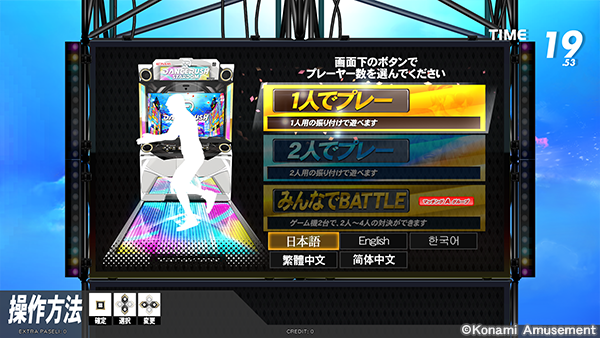
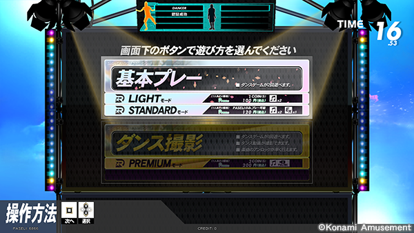

  

    Table of contents
  

  {: .text-delta }
1. TOC
{:toc}

## Starting the Game
{: .fs-9 .no_toc }

## The e-Amusement Card
An e-Amusement card will let you save your progress. Notably, you will be able to track your high scores and have access to unlockable songs/limited time events. A lot of songs are locked from the start, so it's highly recommended to get a card if you want to dedicate time to this game.

*insert card pic here*

If your arcade has e-Amusement service, they probably sell the cards. Just ask for an "e-amuse card" or a "Konami card." They are usually between $5 to $10.

Ideally, you would want to get a newer e-Amusement card with the Amusement IC logo on it since it works for games outside of the Bemani/Konami line of games. The newer versions of other cards (Aime, BANAPASS, NESiCA), which also have the Amusement IC logo, should also work. Otherwise, older e-Amusement IC cards should still work on DRS. 

## Scanning Your Card
Scan your card on the cab's card reader shown below.

*insert pic of cabinet here*

## Creating a Player Profile
### Terms of Service

### PIN Number
Enter a 4-Digit pin number and enter it twice using the keypad. REMEMBER THIS PIN NUMBER since you will be using to login every time you play.

### Dancer Name
Enter the display name associated with your profile with the arrow keys to navigate and the start key to select.
 
## Selecting a Mode
### Number of Players
First off, choose the number of players.

- 1 Player: The most common way to play. You get full access to the pad. Highly recommend playing alone when starting out.
- 2 Players: Two players playing on the same pad. One player gets the front half of the pad, the other player plays on the back half.
- Battle: Two DRS cabinets sync up in a competitive mode where the highest score wins. Up to four players can play.

You can also change the menu language on this page using the left and right arrows keys.

### Mode Select
After choosing the number of players, choose what mode to play.

- LIGHT/STANDARD:
  - LIGHT: In LIGHT Mode, you get two songs.
  - STANDARD: In STANDARD Mode, you get two songs, but scoring higher than 180,000 points in those two songs gives you a third song and access to EXTRA STAGE exclusive songs. We will cover this more later.
- Premium: In PREMIUM Mode, you only get one song, but the cabinet records your play session. We will cover this more later. 

## Limited Time Events
After your selection, there might be a popup or cutscene for either a stamp song or an event. Don't worry about it for now, we'll cover it later in the guide.
